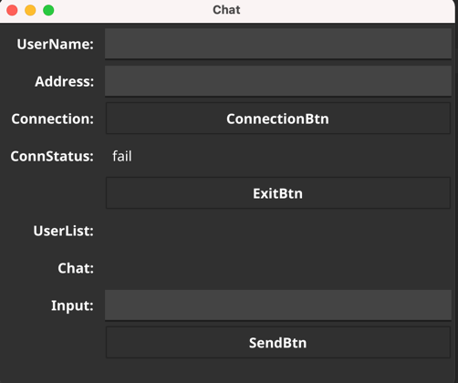
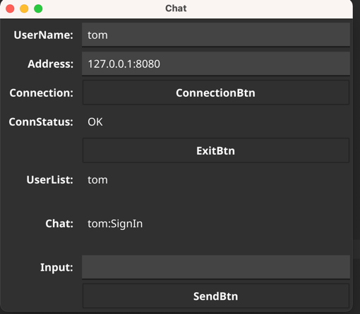
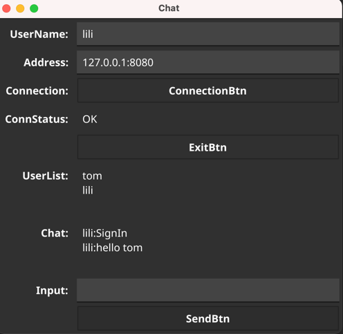
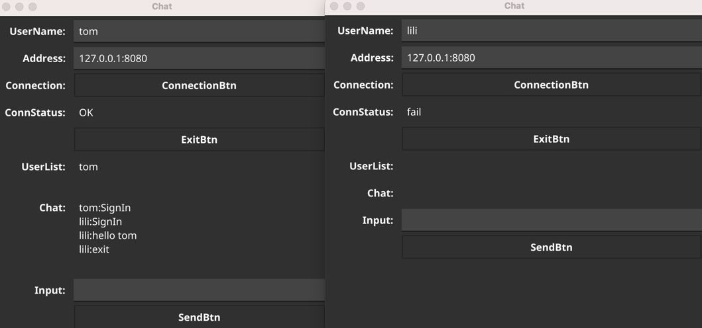
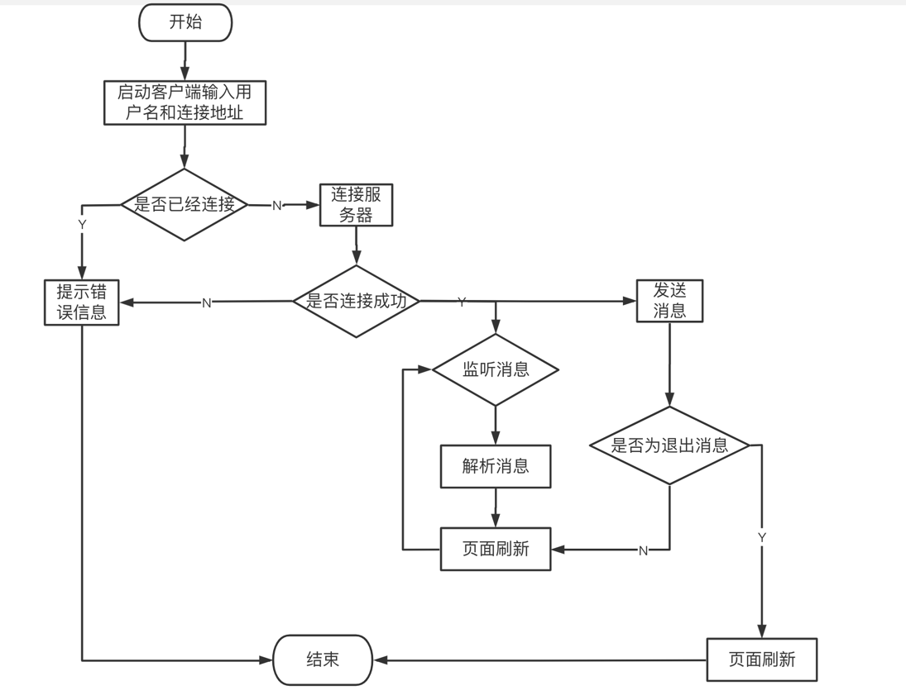

#### 1、整体框架

服务端 :基于Gorilla/Websocket协议的在线聊天服务，通信协议使用Protobuf
客户端：使用fyne开发聊天客户端

#### 2、目录结构

```
.
├── README.md
├── app
│   └── mian.go
├── go.mod
├── go.sum
├── img
│   ├── img.png
│   ├── img3.png
│   ├── img_1.png
│   └── img_2.png
├── internal
│   ├── config
│   │   └── logConfig.go
│   ├── ctrl
│   │   └── chatCtrl.go
│   ├── log
│   │   └── sys.log
│   ├── model
│   │   ├── ChatProto.pb.go
│   │   ├── ChatProto.proto
│   │   ├── PageElements.go
│   │   └── constantInfo.go
│   ├── service
│   │   └── ChatService.go
│   ├── status
│   │   └── chatRes.go
│   ├── view
│   │   └── chatView.go
│   └── ws
│       └── chatClient.go
└── 客户端流程图.png


```

#### 3. 代码逻辑分层


|层|文件夹|主要职责|调用关系|其他说明|
| ------------ | ------------ | ------------ | ------------ | ------------ |
|应用层 |app/main.go  |服务器启动 |调用view层   |不可同层调用
|ctrl层  |internal/ctrl | 处理来具体业务逻辑| 调用service层，被view调用  |可同层调用
|service层  |internal/service | 处理来自对等方的 ctrl 请求 | 调用ws层 ，被ctrl层调用  |不可同层调用
|ws层 |internal/ws|提供基础的websocket功能 | 调用model，router。被service层调用  |不可同层调用
|view层 |internal/view|客户端页面 | 调用ctrl，model层。被应用层调用  |不可同层调用
| status |internal/status  |定义错误码和错误信息 | 被ctr层调用   |不可同层调用
| model |internal/model  |定义数据类型 | 被ws层   |不可同层调用
| 配置文件 |internal/config  |日志配置 | 被ws层 service层调用   |不可同层调用

#### 4.存储设计

```
message ChatRequest {
    string userName = 1;
    string type = 2;
    string content = 3;
    map<string,string> userList = 4;
}
```

#### 5. 程序截图
主界面:



连接:



发送消息:



退出连接:


#### 6. 第三方库

1. websocket框架
 ```
   代码 https://github.com/gorilla/websocket
   文档 https://pkg.go.dev/github.com/gorilla/websocket
```

2. 用于 数据传输
```
   代码 https://github.com/protocolbuffers/protobuf
   文档 https://developers.google.com/protocol-buffers/docs/gotutorial
```

3. 用于 客户端界面构建
```
   代码 https://github.com/fyne-io/fyne
   文档 https://developer.fyne.io/
```

#### 7. 如何编译执行

go run main.go

#### 8.todo

页面过于简单，数据与页面交互部分优化


#### 10.流程图



